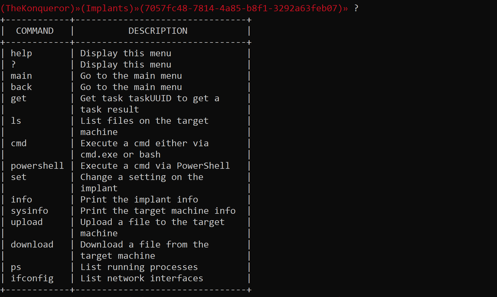

# The Konqueror (ALPHA)

<div align="center">
<p align="center">
  
  
</p>
</div>

The Konqueror is a collaborative Command and Control (C2) framework written in Go.

**Note** - This is not under development anymore and it probably has 1000s of bugs I don't know about. Also, the listener and implant pair provided with this release are only proof of concepts meant to be used to test the framework and not to go undetected in secure environment.

## Features

* **Multi-User** - It allows multiple operators to work concurrently and interact with the same implant
* **Easily Extensible** - It was developed with the aim of allowing operators to shape the framework and include custom components such as language independent listeners and implants
* **API Driven** - Because of its API nature, it allows new listeners and implants to be written in any programming language. It is powered by a RESTful API and a gRPC API (limited to polling functionalities)
* **Cross-Platform** - Being written in Go it can be compiled everywhere for any architecture
* **Fully Open Source** - The Konqueror is completely open source so you can use it and modify it as you wish
* **Extensive Logging** - The API server logs all tasks, implants and listeners info in a SQLite Database. Additional data including errors for troubleshooting and engagement events will be written to a log file too.

## Installation

* Install **GO** - Instructions at https://golang.org/doc/install
* You will at a minimum (if you are using the precompiled versions) need to install the UUID module:
  * `go get github.com/satori/go.uuid`
* Clone this repository:
  * `git clone https://github.com/ctrlc03/the-konqueror.git`
* Navigate to the **src** directory
* Compile the components you need or use the precompiled binaries provided:
  * **server/server.go** - `go GOOS=os GOARCH=arch build server.go` - I'd recommend to run this on Linux
  * **client/client.go** - `GOOS=os GOARCH=arch go build client.go`
  * **listeners/http2/http2listener.go** - `GOOS=os GOARCH=arch go build http2listener.go`

**Note** - Precompiled versions are found inside the relative folder in the **src** folder. Naming convention is as follows:

* **OS_architecture_application** e.g. linux_x64_server. 

OS X Binaries have not been tested, so any help with testing is appreciated - You can submit any issue on the repo's issues section or just Slack me.

If you need to recompile the binaries, you will need to download the following third-party packages:

* `go get github.com/fatih/color`
* `go get github.com/gorilla/mux`
* `go get golang.org/x/net/http2`
* `go get github.com/chzyer/readline`
* `go get github.com/olekukonko/tablewriter`
* `go get github.com/mattn/go-sqlite3`
* `go get github.com/satori/go.uuid`
* `go get google.golang.org/grpc`
* `go get google.golang.org/grpc/credentials`

## Usage

### 1) Start the API Server

* `./linux_x64_server.go -i thekonqueror.server.com -p thekonqueror_rest_api_port -P thekonqueror_gRPC_api_port`
* By defaults it listens on localhost so you can use the `-i` flag to bind to another IP.
* Please run the program with the `-h` flag to list all available command line flags.

### 2) Register an Administrator

For now, to register an admin please insert the credentials (in sha256 hash format) on the Database file (found inside the **src/server** directory) under the user table. Make sure to set **is_admin** to **1**.

Otherwise, the DB comes with default administrator's creds as **admin:admin**.

### 3) Register a new operator

At this time registration can be done with CURL or any other similar utility. Plans are to integrate a Web Interface in future releases.

```bash
curl https://127.0.0.1:9002/admin/register -k -d '{"admin_username":"admin", "admin_password":"admin", "operator_username": "operator", "operator_password":"nevergonnaletyoudown"}' --cacert src/certs/ca/ca.crt --key src/certs/client/client.key --cert src/certs/client/client.crt
```

This is the expected response. If there is any error this will be stored in the **message** field.

```json
{"message":"Successfully created a new operator, you can now login to retrieve its API Key","listener_uuid":"00000000-0000-0000-0000-000000000000"}
```

### 4) Start the client

* `./linux_x64_client.go -u operator_username -P operator_password -i thekonqueror.apiserver.com -p thekonqueror.rest_api_port -g thekonqueror_gRPC_api_port`
* The default API Server address is **127.0.0.1:9002**
* The default gRPC Server port is **9003**
* The default operator's credentials are **operator:nevergonnaletyoudown**
* Please run the program with the `-h` flag for a list of all available options.

### 5) Generate a new listener

* From the client application type:
  * `listeners`
  * `generate http2 AESKEY HMACKEY`


* Take the **UUID** and paste it into the **listener_template.json** and the **implant_template.json** files
* Make sure the **AES Key** and **HMAC Key** are set to the values you just inserted

### 6) Configure the **listener_template.json** file

* You can find the template inside the **src/config** directory
* Use this to configure the HTTP/2 listener 
* Add the API Server address and port
* Set the sleep time and the path to the 404 page

Refer to the README available at **src/config/README.md** for more info.

### 7) Run the listener

* `./linux_x64_http2listener -c path_to_the_config_file.json` - If no path is provided it will look for the **config/listener_template.json** file.

### 8) Configure the **implant_template.json** file

* Use this file to set all options e.g. sleep time, jitter, listener address etc.
* Make sure that the encryption keys and the listener details are correct
* For more info refer to the README available at **src/config/README.md**.

### 9) Generate the Implant

**NOTE** - As of now, the **create_implant** utility will simply replace the options in the configuration file by replacing some keywords in the Implant's template source code. This will be changed in later releases to allow dynamic generation of the Implant code with compile time obfuscation.

* Navigate to the **src/build** directory
* Run the build utility: `./linux_x64_create_implant.go`
* Insert the path to the **implant_template.json** file
* Insert the path to the **implant_template.go** file - This can be found in the **src/build** directory
* Insert the name you'd like to save your implant as
* Compile the implant:
  * `GOOS=target_os GOARCH=target_arch go build name_of_implant.go`
* Distribute the implant


### 10) Interact with the implant

* Once the implant runs and calls back to the listener, a notification will appear on the client


* Type `interact` and use tab autocomplete to select the implant
* You can check the implant's info and target system info with `info` and `sysinfo` respectively
* For a list of all available commands, please refer to the help menu and to the `README` file in the `src/implants/http2_poc` directory or simply type help in the implant's menu.




## Contributing

### Help with the code

If you'd like to contribute in any way e.g. developing new channels, please let me know.

### Issues

Please report any issues in the issues section. Please include as much detail as possible.

## Future Work

> Note. Discountinued

The following are some of the ideas (in no particular order) I have in mind to further improve The Konqueror which will be implemented in future releases:

* Dynamic code generation and obfuscation of the implant source
* Adding process injection capabilities to the implant  
* Add registration on first run of the server
* Develop a Web Interface client
* Build Listeners and Implants that can talk DNS and SMB
* Add freshness check on tasks sent back from the implant 

## License

The Konqueror is provided under the [MIT](https://opensource.org/license/mit/) license.
